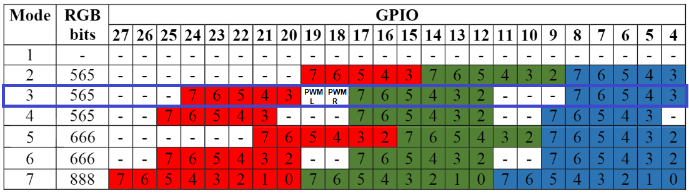
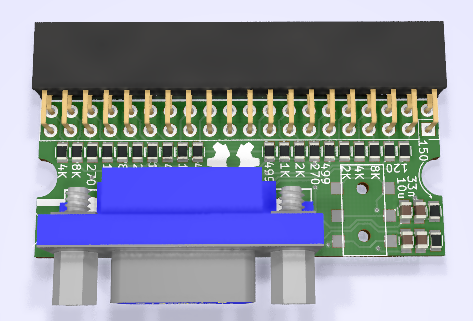

[:fr:](LISEZMOI.md) [:uk:](README.md)

# Pi400VGA
interface VGA pour Raspberry Pi 400

:warning: pour du retrogaming sur écran cathodique, voir https://github.com/llegoff/Pi400RGB

pour le pi zero, voir https://github.com/llegoff/VGA_Zero

achetez sur [ebay](https://www.ebay.fr/itm/154872763613) :package:

### DPI (Display parallel Interface)
Comme pour l'interface [VGA666](https://github.com/fenlogic/vga666), ce montage utilise le l'interface DPI du Raspberry pi (mode 3), 

voir https://www.raspberrypi.org/documentation/hardware/raspberrypi/dpi/README.md

seuls les bits nécessaires du dpi sont redirigées sur le port GPIO 40 broches, avec la ligne 'gpio=2-8,12-17,20-24=a2' dufichier config.txt 

/boot/config.txt

    # disable i2c, pin use by h-sync & v-sync
    dtparam=i2c_arm=off
    # remplacer dtoverlay=vc4-kms-v3d par
    dtoverlay=vc4-fkms-v3d
    #configuration DPI
    gpio=2-8,12-17,20-24=a2
    dpi_output_format=0x13
    enable_dpi_lcd=1
    display_default_lcd=1
    dpi_group=2
    dpi_mode=16
    #---------------- dpi_mode line ---------------------
    #---> 640x480 60hz    dpi_mode=4
    #---> 800x600 60hz    dpi_mode=9
    #---> 1024x768 60hz   dpi_mode=16
    #---> 1280x768 60hz   dpi_mode=23
    #---> 1280x800 60hz   dpi_mode=28
    #---> 1280x960 60hz   dpi_mode=32
    #---> 1280x1024 60hz  dpi_mode=35
    #---> 1360x768 60hz   dpi_mode=39
    #---> 1366x768 60hz   dpi_mode=81
    #---> 1400x1050 60hz  dpi_mode=42
    #---> 1440x900 60hz   dpi_mode=47
    #---> 1600x1200 60hz  dpi_mode=51
    #---> 1680x1050 60hz  dpi_mode=58
    #---> 1920x1080 60hz  dpi_mode=82
    #---> 1920x1200 60hz  dpi_mode=69
    #---> 1920x1440 60hz  dpi_mode=73    

Configuration fonctionnant avec le pilote vc4-kms-v3d

    dtoverlay=vc4-kms-dpi-generic,rgb565-padhi
    dtparam=hactive=800,hfp=40,hsync=128,hbp=88
    dtparam=vactive=600,vfp=1,vsync=4,vbp=23
    dtparam=clock-frequency=40000000
    #   Resolution@freq  hactive hfp hsync  hbp vactive vfp vsync vbp  clock-frequency
    #VGA   640x480  @60   640     16   96    48   480    10   2    33    25175000
    #SVGA  800x600  @60   800     40  128    88   600     1   4    23    40000000
    #XGA  1024x768  @60  1024     24  136   160   768     3   6    29    65000000
    #VESA 1368x768  @60  1368     72  144   216   768     1   3    23    85860000
    #VESA 1280x800  @60  1280     64  136   200   800     1   3    24    83460000
    #VESA 1280x1024 @60  1280     48  112   248  1024     1   3    38   108000000
    #VESA 1400x1050 @60  1400     88  152   240  1050     1   3    33   122660000
    #VESA 1600x1200 @60  1600     64  192   304  1200     1   3    46   162000000
    #--- TV -----
    #244p (NTSC res)@60   320      4   30    46   240     4   5    14     6400000
    #288p (PAL res) @50   384     16   32    40   288     3   2    19     7363200
    #480i (NTSC res)@60   640     24   64   104   480     3   6    34    13054080
    #576i (PAL res) @50   768     24   72    88   576     6   5    38    14875000
    #480p           @60   640     24   96    48   480    11   2    32    25452000
    #720p           @60  1280    110   40   220   720     5   5    20    74250000
    #1080p          @60  1920     88   44   148  1080     4   5    36   148500000
    #more timming on http://tinyvga.com/vga-timing

### Ecran Cathodique 15khz

:point_up: cette configuration ne fonctionne qu'avec Raspberry pi OS, et ne fonctionne pas avec Recalbox OS ou RGB-Pi OS (qui utilise le pilote rpi-dpidac, qui ne fonctionne qu'avec le dpi_mode 5 & 6)

pour une interface compatible avec RecalboxOS et RGB-Pi OG , voir https://github.com/llegoff/Pi400RGB

    # disable i2c, pin use by h-sync & v-sync
    dtparam=i2c_arm=off
    gpio=2-8,12-17,20-24=a2
    dpi_output_format=0x13
    enable_dpi_lcd=1
    display_default_lcd=1
    dpi_group=2
    dpi_mode=87
    #hdmi_timings=506 1 8 48 56 240 1 3 10 6 0 0 0 60 0 9600000 1
    #hdmi_timings=512 1 16 48 64 288 1 3 5 6 0 0 0 50 0 9600000 1
    # Custom 15kHz mode
    hdmi_timings=506 1 8 44 52 240 1 6 10 6 0 0 0 60 0 9600000 1
    #hdmi_timings=320 1 17 33 34 224 1 14 8 18 0 0 0 60 0 6400000 1
    #hdmi_timings=960 0 173 8 0 160 0 40 10 0 0 0 0 60 0 19200000 8
    #hdmi_timings=320 1 25 30 30 240 1 9 3 10 0 0 0 60 0 6400000 1
    #hdmi_timings=1920 1 52 208 260 240 1 6 10 6 0 0 0 60 0 38400000 1
    
### Recalbox

editer le fichier /boot/config.txt
chercher la section 

    [pi4]
    temp_soft_limit=70
    dtoverlay=vc4-kms-v3d
    
remplacer par

    [pi4]
    temp_soft_limit=70
    dtoverlay=vc4-fkms-v3d

copier le contenu de [config-example.txt](img/config-example.txt?raw=true) a la fin du fichier /boot/recalbox-user-config.txt
    
pour le mode crt , Recalbox 8 utilise le driver rpi-dpidac, qui n'est pas compatible avec le mode 3 dpi
    
voir https://wiki.recalbox.com/fr/tutorials/video/crt/crt-screen-dpi-vga666-piscart-rgbpi

    
### Double Ecran (VGA + HDMI)

sur le pi4 et pi400, la fonction double ecran est prise en charge par le driver vc4 fkms v3d

    [pi4]
    # Enable DRM VC4 V3D driver on top of the dispmanx display stack
    dtoverlay=vc4-fkms-v3d
    max_framebuffers=2

### Bureau à distance en double écrans

installation de freeRDP

    sudo apt-get install freerdp2-x11

lancement d'un session freeRDP
    
    xfreerdp /v:<nom ou IP de l'ordinateur> /u:<utilisateur> /d:<domaine> /sound:sys:alsa /multimon

or

    xfreerdp /v:<nom ou IP de l'ordinateur> /u:<utilisateur> /d:<domaine> /g:<nom ou IP de la passerelle RDP> /gu:<utilisateur de la passerelle> /gd:<domaine de la passerelle> /sound:sys:alsa /multimon

### Interface audio
le son est généré en MLI (PWM) à partir des broches gpio 18 & 19

/boot/config.txt

    # Enable audio on GPIO for Pi 400
    dtoverlay=audremap,pins_18_19
    dtparam=audio=on
    
## Schéma & Circuit Imprimé

## Installation
Copier le contenu du fichier [config-example.txt](img/config-example.txt?raw=true) dans le fichier /boot/config.txt

## Révision
rev1

