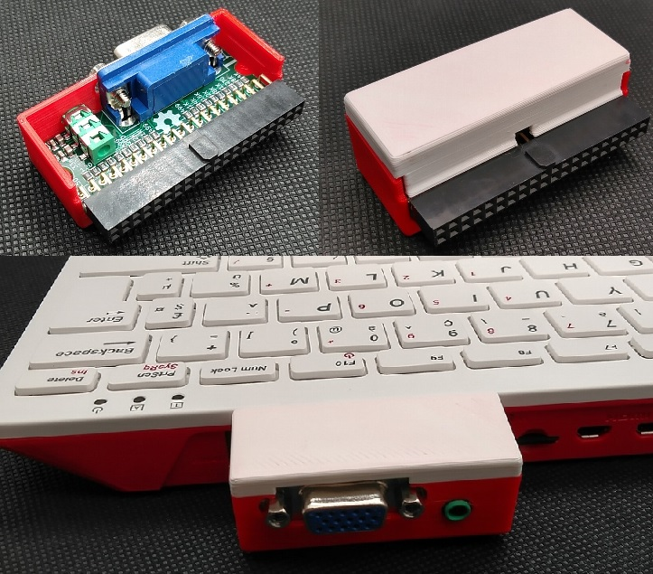
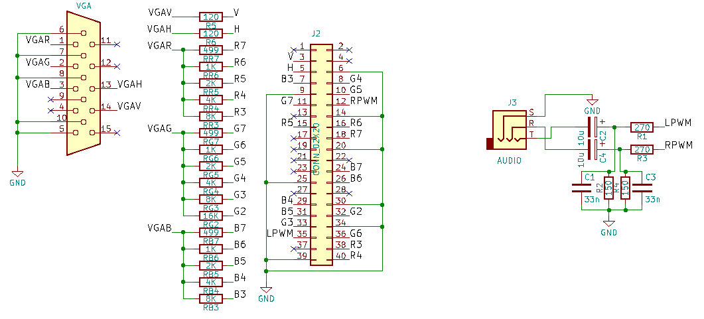
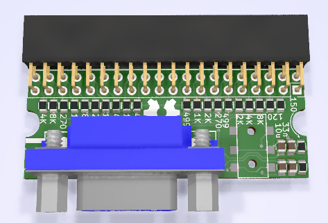

[:fr:](LISEZMOI.md) [:uk:](README.md)

# Pi400VGA
VGA interface for Raspberry Pi 400

for pi zero see https://github.com/llegoff/VGA_Zero

buy on [ebay](https://www.ebay.fr/itm/154653579068) :package:  

### DPI (Display parallel Interface)
Like [VGA666](https://github.com/fenlogic/vga666), this pcb uses dpi interface (in mode 3 to free gpio 18 & 19)

see https://www.raspberrypi.org/documentation/hardware/raspberrypi/dpi/README.md

only the necessary bits of the dpi are redirected to the 40-pin GPIO port, with the 'gpio=2-8,12-17,20-24=a2' line on config.txt

/boot/config.txt
    
    # disable i2c, pin use by h-sync & v-sync
    dtparam=i2c_arm=off
    gpio=2-8,12-17,20-24=a2
    dpi_output_format=0x13
    enable_dpi_lcd=1
    display_default_lcd=1
    dpi_group=2
    dpi_mode=16
    #---------------- dpi_mode line ---------------------
    #---> 640x480 60hz    dpi_mode=4
    #---> 800x600 60hz    dpi_mode=9
    #---> 1024x768 60hz   dpi_mode=16
    #---> 1280x768 60hz   dpi_mode=23
    #---> 1280x800 60hz   dpi_mode=28
    #---> 1280x960 60hz   dpi_mode=32
    #---> 1280x1024 60hz  dpi_mode=35
    #---> 1360x768 60hz   dpi_mode=39
    #---> 1366x768 60hz   dpi_mode=81
    #---> 1400x1050 60hz  dpi_mode=42
    #---> 1440x900 60hz   dpi_mode=47
    #---> 1600x1200 60hz  dpi_mode=51
    #---> 1680x1050 60hz  dpi_mode=58
    #---> 1920x1080 60hz  dpi_mode=82
    #---> 1920x1200 60hz  dpi_mode=69
    #---> 1920x1440 60hz  dpi_mode=73

### 15khz cathode ray screen

    # disable i2c, pin use by h-sync & v-sync
    dtparam=i2c_arm=off
    gpio=2-8,12-17,20-24=a2
    dpi_output_format=0x13
    enable_dpi_lcd=1
    display_default_lcd=1
    dpi_group=2
    dpi_mode=87
    #hdmi_timings=506 1 8 48 56 240 1 3 10 6 0 0 0 60 0 9600000 1
    #hdmi_timings=512 1 16 48 64 288 1 3 5 6 0 0 0 50 0 9600000 1
    # Custom 15kHz mode
    hdmi_timings=506 1 8 44 52 240 1 6 10 6 0 0 0 60 0 9600000 1
    #hdmi_timings=320 1 17 33 34 224 1 14 8 18 0 0 0 60 0 6400000 1
    #hdmi_timings=960 0 173 8 0 160 0 40 10 0 0 0 0 60 0 19200000 8
    #hdmi_timings=320 1 25 30 30 240 1 9 3 10 0 0 0 60 0 6400000 1
    #hdmi_timings=1920 1 52 208 260 240 1 6 10 6 0 0 0 60 0 38400000 1
    
for Recalbox see https://recalbox.gitbook.io/tutorials/v/francais/video/crt/configurez-votre-ecran-cathodique-sur-le-bus-dpi-vga666-piscart-rgbpi

### Dual Screen (VGA + HDMI)

on the pi4 and pi400, the dual screen function is supported by the vc4 fkms v3d driver

    [pi4]
    # Enable DRM VC4 V3D driver on top of the dispmanx display stack
    dtoverlay=vc4-fkms-v3d
    max_framebuffers=2

### Remote Desktop MultiMonitor
install freeRDP

    sudo apt-get install freerdp2-x11

start freeRDP session
    
    xfreerdp /v:<computer name or IP> /u:<user> /d:<domain> /sound:sys:alsa /multimon

or

    xfreerdp /v:<computer name or IP> /u:<user> /d:<domain> /g:<gateway name or IP> /gu:<gateway user> /gd:<gateway domain> /sound:sys:alsa /multimon

### Audio Interface
audio interface is connected to gpio 18 & 19 (PWM)

/boot/config.txt

    # Enable audio for PiZero(loads snd_bcm2835)
    dtoverlay=audremap,pins_18_19
    dtparam=audio=on

## Schematic

## PCB

## Installation
copy content of [config-example.txt](img/config-example.txt?raw=true) to /boot/config.txt

## Révision
rev1
